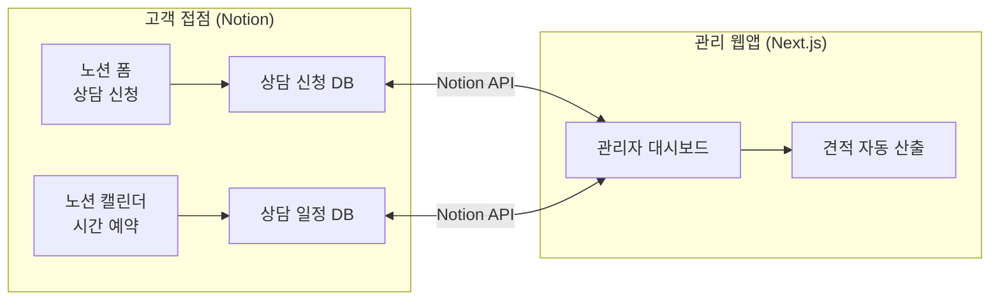
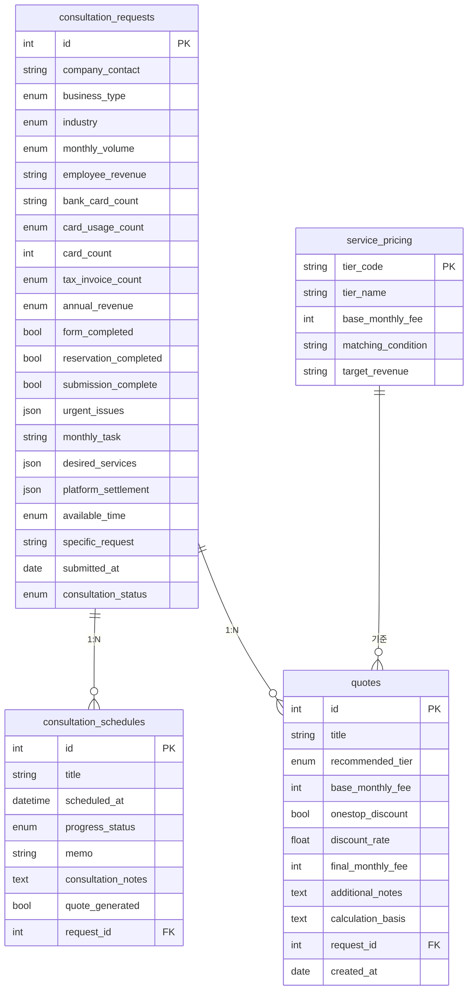
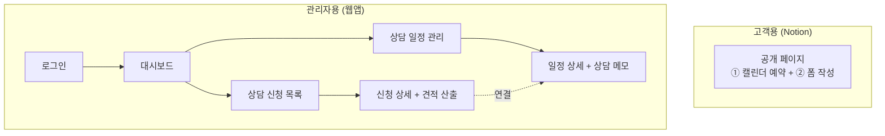
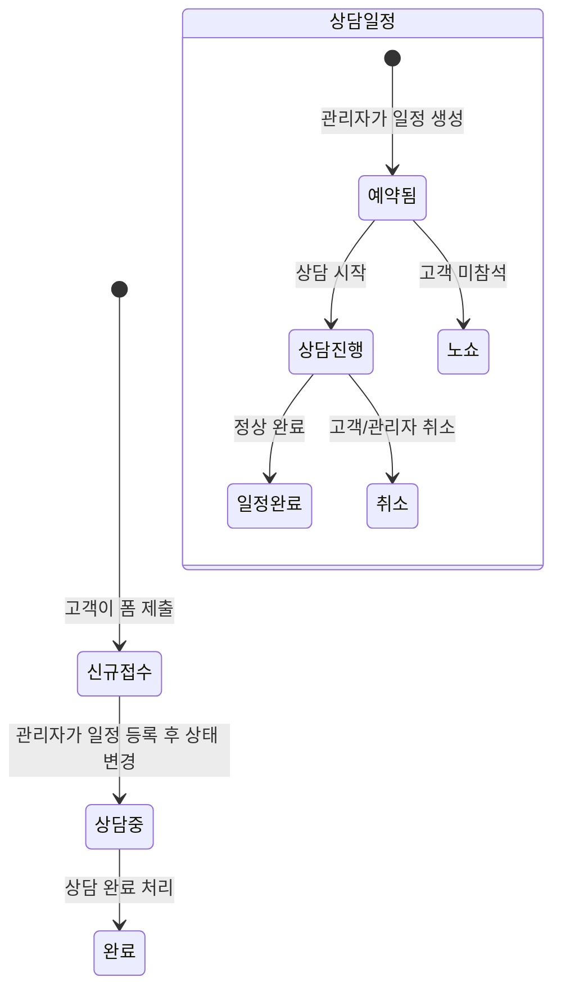

# 경리아웃소싱 상담 관리 시스템 — 웹 개발 요구사항 명세서

## 1. 프로젝트 개요

### 1.1 목적

현재 Notion 기반으로 운영 중인 **경리아웃소싱 상담 관리 대시보드**의 데이터(DB, 폼, 캘린더)는 **Notion을 그대로 활용**하면서, 관리자가 **웹에서 보기 좋게 조회·관리할 수 있는 관리 대시보드**를 구축합니다. 상담 신청 접수 → 시간 예약 → 상담 진행 → **견적 자동 산출**까지 전체 워크플로우를 지원합니다.

### 1.2 하이브리드 아키텍처 (Notion + Web)

<aside>
🏗️

**핵심 설계 원칙**: Notion이 **데이터 저장소(DB) + 고객 접점(폼·캘린더)**을 담당하고, 웹 애플리케이션은 **관리자용 대시보드 + 비즈니스 로직(견적 자동 산출 등)**을 담당합니다.

</aside>

| **구분** | **담당** | **설명** |
| --- | --- | --- |
| **상담 신청 폼** | Notion 폼 | 고객이 직접 작성하는 공개 폼 → 제출 시 Notion DB에 자동 저장 |
| **상담 시간 예약** | Notion Calendar | 고객이 직접 가능한 시간대를 선택하여 예약 (1시간 단위, 중복 방지) |
| **DB (데이터 저장)** | Notion DB | 상담 신청, 상담 일정, 요금표 등 모든 데이터를 Notion DB에 저장 |
| **관리자 대시보드** | 웹 애플리케이션 | Notion API로 데이터를 읽어 보기 좋은 UI로 시각화·관리 |
| **견적 자동 산출** | 웹 애플리케이션 | 상담 데이터 + 요금 기준표 기반 자동 산출 로직 |

### 1.3 전체 시스템 흐름도



### 1.4 고객용 상담 신청 페이지 (Notion 기반)

고객에게 **하나의 공개 Notion 페이지 링크**를 공유합니다. 이 페이지에서 **두 가지를 모두 완료해야 신청 완료**됩니다.

1. **① 노션 캘린더에서 상담 시간 예약** — 1시간 단위, 평일 10~18시, 동일 시간 중복 예약 방지
2. **② 노션 폼에서 상담 신청서 작성** — 필수 항목 작성 후 제출

<aside>
✅

**접수 완료 조건**: 폼 작성 + 시간 예약 **둘 다 완료**된 건만 `신규접수` 상태로 표시됩니다. 하나만 완료된 경우 `미완료` 상태로 별도 관리합니다.

</aside>

### 1.5 기존 Notion API 연동 정보

<aside>
⚠️

**보안 주의**: API Key는 반드시 서버 측(환경변수)에서만 사용하고, 클라이언트에 노출하지 않습니다.

</aside>

- **Notion API Key**: `YOUR_NOTION_API_KEY`
- **상담 일정 DB ID**: `7bdcf9acc8594ae9a8bb9a834155cddd`

---

## 2. 데이터 모델 (DB 스키마)

### 2.1 📋 상담 신청 (consultation_requests)

고객이 폼을 통해 제출하는 상담 신청 데이터입니다.

| **필드명** | **DB 컬럼명 (영문 권장)** | **타입** | **필수** | **설명 / 옵션값** |
| --- | --- | --- | --- | --- |
| 회사명/담당자/연락처 | `company_contact` | TEXT (Title) | ✅ | 예) (주)ABC / 홍길동 대표 / 010-1234-5678 |
| 사업자 유형 | `business_type` | ENUM | ✅ | `개인사업자` | `법인사업자` |
| 주요 업종 | `industry` | ENUM | ✅ | `음식점/프랜차이즈` | `온라인몰/플랫폼` | `제조/수출` | `IT/서비스` | `도소매/유통` | `기타` |
| 월 거래량/세금계산서 | `monthly_volume` | ENUM | ✅ | `월 거래 50건 이하 / 세금계산서 5건 이하` | `월 거래 51~150건 / 세금계산서 6~20건` | `월 거래 151~400건 / 세금계산서 21~60건` | `월 거래 401건 이상 / 세금계산서 61건 이상` | `기타` |
| 직원 수 및 연매출 | `employee_revenue` | TEXT | ✅ | 예) 직원 5명(4대보험) / 프리랜서 2명 / 월매출 약 3,000만원 |
| 통장/법인카드 개수 | `bank_card_count` | TEXT | ✅ | 예) 통장 3개 / 법인카드 2개 |
| 카드 사용 건수 (월) | `card_usage_count` | ENUM | ✅ | `50건 이하` | `51~150건` | `151~400건` | `401건 이상` |
| 카드 개수 | `card_count` | NUMBER | ✅ | 사용 중인 법인/사업용 카드 수 |
| 세금계산서 발행 건수 (월) | `tax_invoice_count` | ENUM | ✅ | `5건 이하` | `6~20건` | `21~60건` | `61건 이상` |
| 연매출 규모 | `annual_revenue` | ENUM | ✅ | `10억 이하` | `10억~50억` | `50억~100억` | `100억 이상` |
| 폼 작성 완료 여부 | `form_completed` | BOOLEAN | 자동 | 폼 제출 시 자동 `true` |
| 예약 완료 여부 | `reservation_completed` | BOOLEAN | 자동 | 캘린더 예약 시 자동 `true` |
| 접수 완료 여부 | `submission_complete` | BOOLEAN (Computed) | 자동 | `form_completed AND reservation_completed` — 둘 다 true일 때만 접수 완료 |
| 지금 가장 급한 문제 | `urgent_issues` | MULTI_ENUM | ✅ | `경리 퇴사/공백 발생` | `기존 경리 업무 과다로 인력 보강 필요` | `자금 누락/중복 지급 우려` | `카드 품목이 엉망이라 원가를 모르겠음` | `급여/4대보험 처리가 너무 복잡함` | `통장 잔고는 없는데 세금은 왜 많이 나오는지 모르겠음` | `투자 유치/대출 위해 정확한 재무제표 필요` | `기타` |
| 이번 달 해결 과제 | `monthly_task` | TEXT | ✅ | 이번 달 안에 꼭 해결해야 하는 일 (자유 입력) |
| 원하는 서비스 | `desired_services` | MULTI_ENUM |  | `세금계산서/현금영수증 발행` | `지출결의/자금 이체 대행` | `자금일보 (매일 통장잔고 보고)` | `급여계산/4대보험 신고/급여명세서 발송` | `근로계약서 및 취업규칙 작성/노무리스크 진단` | `카드품목 상세 분류` | `월/분기/반기 결산 + 손익 분석` | `실제 마진 계산` | `미수/미지급 관리` | `기타` |
| 온라인 플랫폼 정산 | `platform_settlement` | MULTI_ENUM |  | `없음` | `쿠팡 정산` | `네이버 스마트스토어` | `배달의민족/배달앱` | `기타` |
| 상담 가능 시간대 | `available_time` | ENUM |  | `평일 오전 (10~12시)` | `평일 오후 (14~17시)` | `토요일 및 평일 저녁 (사전조율)` | `언제든 가능` |
| 구체적 요청사항 | `specific_request` | TEXT |  | 자유 입력 |
| 접수일 | `submitted_at` | DATE | 자동 | 폼 제출 시 자동 기록 |
| 상담 상태 | `consultation_status` | ENUM (Status) | 자동 | **Todo**: `신규접수` / **In Progress**: `상담중` / **Complete**: `완료` |
| 상담 일정 (관계) | `schedule_id` | FK → schedules |  | 상담 일정 테이블과 연결 |

### 2.2 📅 상담 일정 (consultation_schedules)

관리자가 직접 등록하는 상담 일정 데이터입니다.

| **필드명** | **DB 컬럼명 (영문 권장)** | **타입** | **필수** | **설명 / 옵션값** |
| --- | --- | --- | --- | --- |
| 상담 일시 | `title` | TEXT (Title) | ✅ | 상담 일정 제목/설명 |
| 예약 일시 | `scheduled_at` | DATETIME | ✅ | 상담 예약 날짜와 시간 |
| 진행 상태 | `progress_status` | ENUM (Status) | ✅ | **Todo**: `예약됨` / **In Progress**: `상담중` / **Complete**: `완료`, `취소`, `노쇼` |
| 메모 | `memo` | TEXT |  | 상담 관련 메모 |
| 상담 내용 메모 | `consultation_notes` | TEXT (Long) |  | 관리자가 상담 중/후 작성하는 상세 메모 (고객 요구사항, 특이사항, 후속 조치 등) |
| 견적 산출 여부 | `quote_generated` | BOOLEAN | 자동 | 견적 산출 완료 시 `true` |
| 상담 신청자 (관계) | `request_id` | FK → consultation_requests |  | 상담 신청 테이블과 연결 (양방향) |

### 2.3 💰 요금 기준표 (service_pricing)

견적 자동 산출의 기준이 되는 요금 데이터입니다. 홈페이지 요금표 기반.

| **서비스 등급** | **코드** | **월 기본료 (원)** | **매칭 조건** | **대상 연매출** |
| --- | --- | --- | --- | --- |
| **LITE (실속형)** | `LITE` | 400,000 | 월 거래 50건 이하, 세금계산서 5건 이하 | ~10억 |
| **BASIC (일반형)** | `BASIC` | 800,000~ | 월 거래 51~150건, 세금계산서 6~20건 | ~50억 |
| **PREMIUM (고급형/Best)** | `PREMIUM` | 1,000,000~ | 월 거래 151~400건, 세금계산서 21~60건 | ~100억 |
| **LUXURY (명품형)** | `LUXURY` | 2,000,000~ | 월 거래 401건 이상, 세금계산서 61건 이상 | 100억+ |

<aside>
🎁

**원스톱 할인 정책**: 기장료 + 경리아웃소싱 동시 계약 시

- 기본 할인: **25%**
- 추가 할인: **+5%** (합계 30%)
</aside>

### 2.4 📝 견적서 (quotes)

상담 완료 후 자동/수동 산출되는 견적 데이터입니다.

| **필드명** | **DB 컨럼명** | **타입** | **필수** | **설명** |
| --- | --- | --- | --- | --- |
| 견적 제목 | `title` | TEXT (Title) | ✅ | 예) "(주)ABC 경리아웃소싱 견적서" |
| 추천 등급 | `recommended_tier` | ENUM | ✅ | `LITE` | `BASIC` | `PREMIUM` | `LUXURY` |
| 월 기본료 | `base_monthly_fee` | NUMBER | ✅ | 등급별 기본 월 요금 (원) |
| 원스톱 할인 적용 | `onestop_discount` | BOOLEAN |  | 기장료+경리아웃소싱 동시 계약 시 할인 적용 |
| 할인율 | `discount_rate` | NUMBER |  | 할인율 (%) — 기본 25%, 원스톱 30% |
| 할인 후 월 요금 | `final_monthly_fee` | NUMBER (Computed) | 자동 | `base_monthly_fee × (1 - discount_rate/100)` |
| 추가 옵션 설명 | `additional_notes` | TEXT |  | 카드 수 추가, 플랫폼 정산 등 별도 안내 |
| 산출 근거 | `calculation_basis` | TEXT | 자동 | 연매출, 월거래량, 세금계산서 건수 등 산출에 사용된 데이터 요약 |
| 상담 신청 (FK) | `request_id` | FK → consultation_requests | ✅ | 어떤 상담 신청에 대한 견적인지 |
| 산출일 | `created_at` | DATE | 자동 | 견적 산출 일시 |

### 2.5 테이블 관계도 (ERD)



---

## 3. 사용자 역할 및 권한

| **역할** | **설명** | **권한** |
| --- | --- | --- |
| **고객 (비회원)** | 상담 신청 폼을 작성하는 외부 사용자 | 상담 신청 폼 작성 및 제출만 가능 |
| **관리자 (Admin)** | 천지세무법인 내부 직원 | 전체 CRUD, 상태 변경, 일정 관리, 대시보드 조회 |

---

## 4. 주요 기능 요구사항

### 4.1 고객용 — 상담 신청 (Notion 폼 + 캘린더)

<aside>
📌

고객에게 공유하는 **단일 Notion 페이지**에서 예약 + 폼 작성을 모두 진행합니다.

</aside>

**캘린더 예약:**

- [ ]  Notion Calendar 임베드로 상담 시간 예약 (1시간 단위)
- [ ]  평일 10시~18시 예약 가능 시간대 설정
- [ ]  동일 시간대 중복 예약 방지
- [ ]  예약 완료 시 `reservation_completed = true` 자동 설정

**폼 작성:**

- [ ]  Notion 폼으로 상담 신청서 작성 (2.1 스키마 기반)
- [ ]  필수 항목 유효성 검증 (카드 사용 건수, 카드 개수, 세금계산서 건수, 연매출 규모 포함)
- [ ]  제출 시 `form_completed = true`, `접수일` 자동 기록
- [ ]  모바일 반응형 대응

**접수 완료 추적:**

- [ ]  `submission_complete` = `form_completed AND reservation_completed`
- [ ]  둘 다 완료된 건만 `신규접수` 상태로 전환
- [ ]  하나만 완료된 건은 `미완료` 상태로 별도 관리
- [ ]  관리자 대시보드에서 미완료 건 별도 필터링 가능

### 4.2 관리자용 — 상담 신청 목록 (Dashboard)

- [ ]  **테이블 뷰**: 전체 상담 신청 목록을 테이블 형태로 표시
- [ ]  **필터링**: 상담 상태, 사업자 유형, 주요 업종, 접수일 범위 등으로 필터
- [ ]  **검색**: 회사명/담당자/연락처 텍스트 검색
- [ ]  **정렬**: 접수일, 상담 상태 등 기준 정렬
- [ ]  **상세 보기**: 클릭 시 상담 신청 전체 정보 모달 또는 상세 페이지
- [ ]  **상태 변경**: `신규접수` → `상담중` → `완료` 상태 전환
- [ ]  **상담 일정 연결**: 해당 신청에 상담 일정을 연결/생성 가능

### 4.3 관리자용 — 상담 일정 관리

- [ ]  **캘린더 뷰**: 예약 일시 기준 월간/주간 캘린더 표시
- [ ]  **테이블 뷰**: 전체 일정 목록 (필터/정렬 지원)
- [ ]  **일정 등록**: 예약 일시, 상담 일시(제목), 진행 상태, 메모 입력
- [ ]  **상담 신청자 연결**: 일정 등록 시 상담 신청 목록에서 고객 선택하여 연결
- [ ]  **상태 관리**: `예약됨` → `상담중` → `완료` / `취소` / `노쇼`
- [ ]  **드래그 앤 드롭**: 캘린더에서 일정 이동 가능 (선택사항)
- [ ]  **상담 내용 메모 영역**: 상담 중/후 관리자가 작성하는 상세 메모 (Notion API로 저장)

### 4.5 관리자용 — 견적 자동 산출

<aside>
💰

상담 신청 데이터 + 요금 기준표(2.3)를 기반으로 **자동으로 견적을 산출**합니다. 관리자가 수동 조정도 가능합니다.

</aside>

**자동 산출 로직:**

- [ ]  `annual_revenue` + `monthly_volume` 기반으로 서비스 등급 자동 추천
- [ ]  등급별 기본 월 요금 자동 매칭 (LITE 40만 / BASIC 80만~ / PREMIUM 100만~ / LUXURY 200만~)
- [ ]  원스톱 할인 적용 여부 토글 (기장료+경리아웃소싱 동시 계약 시 25%+5%=30% 할인)
- [ ]  할인 후 최종 월 요금 자동 계산
- [ ]  카드 개수·플랫폼 정산 등 추가 옵션 안내 텍스트 자동 생성
- [ ]  산출 근거 자동 요약 (연매출, 월거래량, 세금계산서 건수 등)

**수동 조정 기능:**

- [ ]  관리자가 등급 변경, 요금 수동 입력, 할인율 조정 가능
- [ ]  추가 옵션 설명 자유 입력
- [ ]  견적서 PDF 내보내기 (향후 확장)

**등급 자동 매칭 규칙:**

| **우선순위** | **판단 기준** | **LITE** | **BASIC** | **PREMIUM** | **LUXURY** |
| --- | --- | --- | --- | --- | --- |
| 1 | 연매출 | ~10억 | ~50억 | ~100억 | 100억+ |
| 2 | 월 거래량 | 50건↓ | 51~150건 | 151~400건 | 401건+ |
| 3 | 세금계산서 | 5건↓ | 6~20건 | 21~60건 | 61건+ |

<aside>
ℹ️

**매칭 로직**: 연매출 → 월거래량 → 세금계산서 순서로 판단. 여러 기준이 다른 등급을 가리키면 **더 높은 등급**을 추천. 관리자가 최종 결정.

</aside>

### 4.4 관리자용 — 대시보드 (Overview)

- [ ]  **통계 카드**: 신규접수 건수, 상담중 건수, 완료 건수, 오늘 예정 상담
- [ ]  **최근 접수**: 최근 신규 접수된 상담 신청 목록 (최대 5~10건)
- [ ]  **오늘의 일정**: 오늘 예약된 상담 일정 목록
- [ ]  **업종별/상태별 분포**: 간단한 차트 (파이 또는 바)

---

## 5. 화면 구성 (Wireframe 가이드)



### 주요 페이지 목록

**고객용 (Notion)**

1. **Notion 공개 페이지** — 캘린더 예약 + 폼 작성 통합 페이지

**관리자용 (웹 애플리케이션)**

1. **`/login`** — 관리자 로그인
2. **`/dashboard`** — 대시보드 메인 (통계 + 오늘 일정 + 미완료 건)
3. **`/requests`** — 상담 신청 목록 (테이블 + 필터)
4. **`/requests/:id`** — 상담 신청 상세 + **견적 자동 산출 패널**
5. **`/schedules`** — 상담 일정 목록 (캘린더 + 테이블 토글)
6. **`/schedules/:id`** — 상담 일정 상세 + **상담 내용 메모 영역**
7. **`/quotes`** — 견적서 목록 (검색/필터)
8. **`/quotes/:id`** — 견적서 상세/수정

---

## 6. 전체 워크플로우 (Business Logic)

### 6.1 상담 신청 → 일정 등록 → 완료 흐름



### 6.2 상태 연동 규칙

<aside>
🔗

**상담 신청과 상담 일정의 상태는 연동**되어야 합니다.

- 상담 일정이 `상담중`으로 변경되면 → 연결된 상담 신청도 `상담중`으로 자동 변경
- 상담 일정이 `완료`로 변경되면 → 연결된 상담 신청도 `완료`로 자동 변경
- 상담 일정이 `취소` 또는 `노쇼`로 변경되면 → 상담 신청은 `신규접수`로 롤백 (재상담 가능)
</aside>

---

## 7. 기술 스택 제안

<aside>
💻

**하이브리드 아키텍처**: Notion DB가 데이터 저장소 역할을 하므로, 별도 RDB는 필요 없습니다. 웹앱은 Notion API를 통해 데이터를 읽고 쓰는 **관리자 대시보드 + 비즈니스 로직 레이어**입니다.

</aside>

| **구분** | **권장 기술** | **비고** |
| --- | --- | --- |
| 프론트엔드 | Next.js (React) + TypeScript | SSR/SSG 지원, 빠른 개발 |
| UI 프레임워크 | Tailwind CSS + shadcn/ui | 깔끔한 관리자 UI 빠르게 구현 |
| 백엔드/API | Next.js API Routes | Notion API 래퍼 + 비즈니스 로직 (견적 산출 등) |
| **데이터베이스** | **Notion DB** (Notion API로 접근) | **별도 RDB 불필요** — Notion이 데이터 저장소 역할 |
| **Notion 연동** | **@notionhq/client** (Notion SDK) | DB 조회/생성/수정, 페이지 콘텐츠 접근 |
| 인증 | NextAuth.js | 관리자 로그인용 (소수 인원, 간단한 인증) |
| 캘린더 UI | FullCalendar 또는 react-big-calendar | 드래그 앤 드롭 지원 |
| 차트 | Recharts 또는 Chart.js | 대시보드 통계 시각화 |
| 캐싱 | Redis 또는 인메모리 캐시 | Notion API 호출 최소화 (Rate Limit 대응) |
| 배포 | Vercel | Next.js 최적 배포 환경 |

<aside>
⚠️

**Notion API Rate Limit 주의**: Notion API는 초당 3회 요청 제한이 있습니다. 대시보드 통계 등 다건 조회는 **캐싱**(5분 TTL)을 적용하고, 목록 조회는 **페이지네이션** + **인크리멘탈 동기화** 패턴을 사용합니다.

</aside>

---

## 8. API 엔드포인트 설계

### 8.1 상담 신청 (Consultation Requests)

| **Method** | **Endpoint** | **설명** | **인증** |
| --- | --- | --- | --- |
| `POST` | `/api/requests` | 새 상담 신청 생성 (폼 제출) | 불필요 (Public) |
| `GET` | `/api/requests` | 상담 신청 목록 조회 (필터/정렬/페이지네이션) | 필요 (Admin) |
| `GET` | `/api/requests/:id` | 상담 신청 상세 조회 | 필요 (Admin) |
| `PATCH` | `/api/requests/:id` | 상담 신청 수정 (상태 변경 포함) | 필요 (Admin) |
| `DELETE` | `/api/requests/:id` | 상담 신청 삭제 | 필요 (Admin) |

### 8.2 상담 일정 (Consultation Schedules)

| **Method** | **Endpoint** | **설명** | **인증** |
| --- | --- | --- | --- |
| `POST` | `/api/schedules` | 새 상담 일정 등록 | 필요 (Admin) |
| `GET` | `/api/schedules` | 상담 일정 목록 조회 (필터/정렬/페이지네이션) | 필요 (Admin) |
| `GET` | `/api/schedules/:id` | 상담 일정 상세 조회 | 필요 (Admin) |
| `PATCH` | `/api/schedules/:id` | 상담 일정 수정 (상태 변경 포함) | 필요 (Admin) |
| `DELETE` | `/api/schedules/:id` | 상담 일정 삭제 | 필요 (Admin) |

### 8.3 견적서 (Quotes)

| **Method** | **Endpoint** | **설명** | **인증** |
| --- | --- | --- | --- |
| `POST` | `/api/quotes/generate` | 견적 자동 산출 (상담신청 ID 기반) | 필요 (Admin) |
| `GET` | `/api/quotes` | 견적서 목록 조회 | 필요 (Admin) |
| `GET` | `/api/quotes/:id` | 견적서 상세 조회 | 필요 (Admin) |
| `PATCH` | `/api/quotes/:id` | 견적서 수정 (등급/요금/할인율 조정) | 필요 (Admin) |

### 8.4 대시보드 (Dashboard)

| **Method** | **Endpoint** | **설명** | **인증** |
| --- | --- | --- | --- |
| `GET` | `/api/dashboard/stats` | 통계 데이터 (상태별 건수, 오늘 일정 수 등) | 필요 (Admin) |
| `GET` | `/api/dashboard/recent` | 최근 접수 목록 | 필요 (Admin) |
| `GET` | `/api/dashboard/today` | 오늘 예정된 상담 일정 | 필요 (Admin) |
| `GET` | `/api/pricing` | 요금 기준표 조회 (service_pricing) | 필요 (Admin) |

### 8.5 Notion API 래퍼 패턴

<aside>
🔧

모든 API 엔드포인트는 내부적으로 **Notion API**를 호출하여 데이터를 읽고 쓰는 구조입니다.

</aside>

```
[브라우저] → /api/requests (Next.js API Route)
            → notionClient.databases.query({ database_id: '...' })
            → 데이터 변환 (Notion → App 포맷)
            → JSON 응답
```

**핵심 래퍼 함수:**

- `notionService.getRequests(filters)` — 상담 신청 목록 조회
- `notionService.getSchedules(dateRange)` — 상담 일정 조회
- `notionService.updatePageStatus(pageId, status)` — 상태 변경
- `notionService.createQuote(requestId, quoteData)` — 견적서 생성
- `quoteService.calculateTier(requestData)` — 등급 자동 판단
- `quoteService.calculateFee(tier, discount)` — 요금 산출

---

## 9. 데이터 마이그레이션 / DB 세팅

<aside>
📦

하이브리드 아키텍처이므로 별도 DB 마이그레이션은 필요 없습니다. 대신 **기존 Notion DB 스키마 업데이트 + 신규 DB 생성**이 필요합니다.

</aside>

### 9.1 기존 DB 업데이트

1. **상담 신청 DB** — 신규 필드 추가: `card_usage_count`, `card_count`, `tax_invoice_count`, `annual_revenue`, `form_completed`, `reservation_completed`, `submission_complete`
2. **상담 일정 DB** (`7bdcf9acc8594ae9a8bb9a834155cddd`) — 신규 필드 추가: `consultation_notes`, `quote_generated`

### 9.2 신규 DB 생성

1. **요금 기준표 DB** (`service_pricing`) — 4개 등급 데이터 초기 입력
2. **견적서 DB** (`quotes`) — 빈 DB 생성, 상담신청 DB와 Relation 설정

### 9.3 검증

- 기존 데이터에 신규 필드의 기본값 설정 (기존 건들은 `form_completed = true`, `reservation_completed = true`)
- Notion API로 신규 필드가 정상 조회되는지 확인
- Relation 연결 데이터 정합성 테스트

---

## 10. 추가 고려 사항

### 10.1 알림 기능 (향후 확장)

- 새 상담 신청 시 관리자에게 이메일/카카오톡 알림
- 상담 예약 하루 전 고객에게 리마인더 알림
- 상태 변경 시 관련 담당자에게 알림

### 10.2 보안

- 관리자 인증 필수 (로그인 세션 관리)
- API Rate Limiting (공개 폼 스팸 방지)
- 입력값 검증 및 SQL Injection 방지
- 개인정보 암호화 저장 (연락처 등)

### 10.3 성능

- 목록 조회 시 페이지네이션 (기본 20건)
- 캘린더 뷰는 월 단위 데이터만 로드
- 대시보드 통계는 캐싱 적용 (5분 TTL)

---

## 11. 개발 일정 (예상)

| **단계** | **기간** | **내용** |
| --- | --- | --- |
| 1단계: 환경 세팅 + Notion DB | 1주 | Next.js 초기화, Notion SDK 연동, DB 스키마 업데이트, 신규 DB 생성, API 기본 구조 |
| 2단계: Notion 폼/캘린더 세팅 | 0.5주 | 고객용 Notion 공개 페이지 구성 (폼 + 캘린더 임베드) |
| 3단계: 관리자 인증 + 신청 목록 | 1주 | 로그인, Notion API 래퍼, 상담 신청 목록/상세, 필터/검색 |
| 4단계: 일정 관리 + 캘린더 | 1~2주 | 일정 CRUD, 캘린더 뷰, 상태 연동 로직, 상담 메모 기능 |
| **5단계: 견적 자동 산출** | **1주** | 등급 자동 판단, 요금 산출, 할인 로직, 수동 조정 UI |
| 6단계: 대시보드 + 차트 | 1주 | 통계 API, 대시보드 UI, 차트 시각화, 미완료 건 필터링 |
| 7단계: 테스트 + 배포 | 1주 | 통합 테스트, Notion API 연동 테스트, 버그 수정, Vercel 배포 |
| **합계** | **약 6~7.5주** |  |