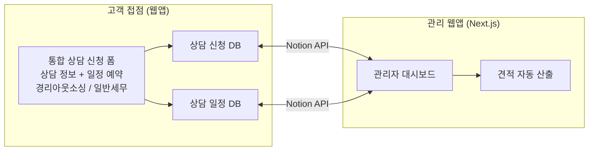

# 보충 요구사항 명세서 v2 — 일반세무 통합 + 일정 시스템 개편 + 견적서 고도화

## 📌 문서 개요

<aside>
🔗

**연계 문서**: [경리아웃소싱 상담 관리 시스템 — 웹 개발 요구사항 명세서](https://www.notion.so/fa9a4b5ab9cc4334b4becc9f64a3efb0?pvs=21) (v1 원본 명세서)

**회의록**: [02-13 경리 아웃소싱 업무 프로세스 자동화 및 신규 수주 전략 논의-transcript](https://www.notion.so/02-13-transcript-30677bbcb05d80019c8df03233f61521?pvs=21)

**작성일**: 2026-02-13

**목적**: v1 명세서 기반 구현 완료 후, 세무사님 피드백을 반영한 **추가·수정 요구사항**을 정리합니다.

</aside>

이 문서는 v1 명세서와 **별도로 존재하되, 기존 시스템 위에 추가/변경**하는 사항만 기술합니다. v1에 이미 정의된 내용 중 변경이 없는 부분은 생략합니다.

---

## 1. 핵심 변경 요약

| **#** | **변경 사항** | **우선순위** | **영향 범위** |
| --- | --- | --- | --- |
| 1 | **일반 세무기장 워크플로우 통합** — 경리아웃소싱과 동일 프로세스, DB 분리, 대시보드 통합 표시 | 🔴 최우선 | DB, 폼, 대시보드, 견적서 전체 |
| 2 | **일정 예약 시스템 전면 개편** — 노션 캘린더 폐기, 웹앱 자체 일정 폼 구현 (일정 DB 직접 저장) | 🔴 최우선 | 고객 접점, 일정 DB, 대시보드 |
| 3 | **상담 신청 정보 편집 기능** — 관리자가 대시보드에서 상담 신청 내용을 직접 수정 | 🟠 높음 | 대시보드 UI, API |
| 4 | **견적서 버그 수정** — 서비스 등급 변경 시 월 기본료 자동 연동 안 되는 문제 | 🟠 높음 | 견적서 비즈니스 로직 |
| 5 | **견적서 PDF 다운로드** — 기존 엑셀 양식 기반 PDF 생성 및 고객 전달 | 🟠 높음 | 견적서 UI, PDF 생성 로직 |
| 6 | **상담 폼 + 일정 예약 통합** — 하나의 폼에서 상담 정보 + 일정 예약을 동시에 처리 | 🟡 중간 | 고객용 폼 UI |
| 7 | **견적서에 선택 서비스 표시 + 일반 세무기장 자동 산정** | 🟡 중간 | 견적서 DB, 산출 로직 |
| 8 | **기타** — 견적서 삭제, 전화번호 입력 UX, 아임웹(imweb) 홈페이지 연동, 실시간 상태 반영 | 🟢 보통 | 다양 |

---

## 2. 일반 세무기장 워크플로우 통합

### 2.1 설계 원칙

<aside>
🏗️

**핵심**: 경리아웃소싱과 일반 세무기장은 **동일한 워크플로우**(폼 접수 → 상담 → 견적 → 계약)를 따르되, **DB는 분리**하고 **대시보드에서는 통합 표시**합니다.

</aside>

### 2.2 데이터 구조 변경

| **구분** | **경리아웃소싱** | **일반 세무기장** |
| --- | --- | --- |
| 상담 신청 DB | 기존 `consultation_requests` 그대로 | **신규**: `tax_consultation_requests` (별도 DB) |
| 일정 DB | **공유**: 기존 `consultation_schedules` 1개 DB에서 `service_type` 필드로 구분 |  |
| 견적서 DB | 기존 `quotes` 그대로 | **신규**: `tax_quotes` (별도 DB) — 매출액 기준 기장료 산정 |
| 요금 기준표 | 기존 `service_pricing` 그대로 | **신규**: `tax_pricing` — 매출액 기준 기장료표 |

### 2.3 일정 DB 필드 추가

| **필드명** | **컬럼명** | **타입** | **설명** |
| --- | --- | --- | --- |
| 서비스 유형 | `service_type` | ENUM (Select) | `경리아웃소싱` | `일반세무기장` — 캘린더에서 색상 구분용 |

### 2.4 캘린더 색상 구분

| **서비스 유형** | **색상** | **용도** |
| --- | --- | --- |
| 일반 세무기장 | 🔵 파란색 | 일반 세무기장 상담 일정 |
| 경리아웃소싱 | 🟡 노란색 | 경리아웃소싱 상담 일정 |

### 2.5 일반 세무기장 상담 신청 DB (`tax_consultation_requests`) 스키마

<aside>
📌

경리아웃소싱 상담 신청 DB(v1)보다 **간소화**된 형태입니다. 핵심은 **매출액 기준 기장료 산정**입니다.

</aside>

| **필드명** | **컬럼명** | **타입** | **필수** | **설명** |
| --- | --- | --- | --- | --- |
| 회사명/담당자/연락처 | `company_contact` | TEXT (Title) | ✅ | 예) (주)ABC / 홍길동 대표 / 010-1234-5678 |
| 사업자 유형 | `business_type` | ENUM | ✅ | `개인사업자` | `법인사업자` |
| 주요 업종 | `industry` | ENUM | ✅ | 경리아웃소싱과 동일 옵션 |
| 연매출 규모 | `annual_revenue` | ENUM | ✅ | `5천만원 이하` | `5천만원~1억` | `1억~3억` | `3억~5억` | `5억~10억` | `10억~50억` | `50억 이상` |
| 신고 주기 | `filing_cycle` | ENUM | ✅ | `월별` | `분기별` | `반기별` |
| 직원 수 | `employee_count` | TEXT |  | 예) 정규직 3명, 프리랜서 1명 |
| 현재 세무대리인 유무 | `has_tax_agent` | BOOLEAN | ✅ | 기존 세무대리인 보유 여부 |
| 구체적 요청사항 | `specific_request` | TEXT |  | 자유 입력 |
| 폼 작성 완료 여부 | `form_completed` | BOOLEAN | 자동 | 폼 제출 시 자동 `true` |
| 예약 완료 여부 | `reservation_completed` | BOOLEAN | 자동 | 일정 예약 시 자동 `true` |
| 접수일 | `submitted_at` | DATE | 자동 | 폼 제출 시 자동 기록 |
| 상담 상태 | `consultation_status` | ENUM (Status) | 자동 | 경리아웃소싱과 동일 상태값 |

### 2.6 일반 세무기장 요금 기준표 (`tax_pricing`)

<aside>
💰

일반 세무기장은 **매출액 기준**으로 기장료가 산정됩니다. 세무사님이 상세 기준을 추가 제공해야 합니다.

</aside>

| **연매출 구간** | **월 기장료 (기본)** | **비고** |
| --- | --- | --- |
| 5천만원 이하 | ⬜ (세무사님 기준 제공 필요) | 개인사업자 기준 |
| 5천만원~1억 | ⬜ |  |
| 1억~3억 | ⬜ |  |
| 3억~5억 | ⬜ |  |
| 5억~10억 | ⬜ |  |
| 10억~50억 | ⬜ |  |
| 50억 이상 | ⬜ | 법인사업자 포함 |

<aside>
⚠️

**세무사님 액션 필요**: 위 요금 기준표의 금액을 채워주셔야 견적 자동 산출 로직을 구현할 수 있습니다. 개인/법인 구분이 필요하면 별도 행으로 추가합니다.

</aside>

### 2.7 대시보드 통합 표시

- **통계 카드**: 경리아웃소싱 / 일반세무기장 각각 신규접수·상담중·완료 건수 표시
- **캘린더 뷰**: `service_type` 기반 색상 구분으로 한 캘린더에서 양쪽 일정 모두 표시
- **상담 신청 목록**: 서비스 유형 필터 추가 (경리아웃소싱 / 일반세무기장 / 전체)
- **대시보드 메인**: 양쪽 데이터를 통합하여 오늘의 일정, 최근 접수 등 표시

### 2.8 아임웹(imweb) 홈페이지 연동

<aside>
🌐

**현재 문제**: 아임웹(imweb) 홈페이지로 들어오는 일반 세무기장 문의가 별도 관리되고 있음 → 담당자가 수동으로 확인 후 노션에 정리하는 비효율적 프로세스

**개선**: 아임웹 홈페이지의 상담 문의 버튼 클릭 시, **일반 세무기장 상담 신청 폼(웹앱)**으로 바로 이동하도록 링크 변경

</aside>

- 아임웹 홈페이지의 "상담문의" 버튼 URL을 웹앱의 일반 세무기장 상담 폼 URL로 교체
- 고객이 폼 작성 → 자동으로 `tax_consultation_requests` DB에 저장
- 기존 아임웹 관리자 페이지 확인 → 노션 정리 → 폼 전달의 3단계 프로세스가 **1단계**로 축소

---

## 3. 일정 예약 시스템 전면 개편

### 3.1 문제점 (현재)

<aside>
❌

**노션 캘린더 연동 실패**: 노션 캘린더에서 예약해도 **일정 DB에 자동으로 쌓이지 않음**. 노션 캘린더는 자체적인 DB 연동을 네이티브 지원하지 않아, 고객이 캘린더에서 예약한 내용이 대시보드에 표시되지 않는 문제가 발생했습니다.

</aside>

### 3.2 방안 비교

| **방안** | **설명** | **장점** | **단점** | **추천** |
| --- | --- | --- | --- | --- |
| **A. 노션 캘린더 유지** | 현재 방식 유지 | 추가 개발 없음 | 일정 DB 연동 불가, 핵심 기능 마비 | ❌ 비추천 |
| **C. 웹앱 자체 일정 폼 구현** ✅ | 웹앱에서 직접 일정 예약 폼을 만들어 일정 DB에 저장 | 완전 제어 가능, 추가 비용 없음, 즉시 DB 반영, 안정적 | 커스텀 캘린더 UI 개발 필요 | ✅ **강력 추천** |

### 3.3 권장안: C. 웹앱 자체 일정 예약 폼

<aside>
✅

**결론**: 웹앱 내에서 **직접 일정 예약 폼**을 구현하여, 고객이 예약하면 **즉시 Notion 일정 DB에 저장**되도록 합니다. 외부 서비스 의존 없이 완전히 자체 제어 가능한 구조입니다.

</aside>

**구현 상세:**

- [ ]  예약 가능 시간대 표시 (평일 10~18시, 1시간 단위)
- [ ]  이미 예약된 시간대는 자동 비활성화 (Notion 일정 DB 조회 기반)
- [ ]  고객이 날짜·시간 선택 → Notion 일정 DB에 즉시 `POST`
- [ ]  예약 완료 시 `reservation_completed = true` 자동 설정
- [ ]  `service_type` 자동 설정 (어떤 폼에서 왔는지에 따라 경리/세무 자동 구분)
- [ ]  전화번호 입력란: **국제번호 제거** → 한국(+82) 고정 또는 텍스트 필드로 변경

### 3.4 시스템 흐름도 변경

---

## 4. 상담 신청 폼 UX 개선

### 4.1 통합 폼 (상담 신청 + 일정 예약)

<aside>
📱

**현재 문제**: 기존에는 노션 캘린더를 활용했기 때문에 상담 폼과 일정 예약이 별도로 분리되어 있었음 → 고객이 일정 예약을 건너뛰는 경우 발생

**개선**: 직접 개발하므로 **하나의 통합 폼**에서 상담 정보 입력과 일정 예약을 **동시에** 처리

</aside>

**하나의 폼에서 처리하는 항목:**

- 상담 신청 정보 (회사명, 사업자유형, 업종, 거래량 등 필수 항목)
- 상담 일정 선택 (날짜·시간 선택 — 예약 가능 시간대 표시)
- 제출 시 상담 신청 DB + 일정 DB에 **동시 저장**
- 접수 완료 확인 화면 ("상담 신청이 완료되었습니다" + 요약 정보)

### 4.2 뒤로가기 데이터 유실 방지

- [ ]  각 Step 진행 시 `sessionStorage` 또는 `localStorage`에 입력 데이터 임시 저장
- [ ]  뒤로가기 시 이전 Step으로 돌아가되, 입력 데이터는 유지
- [ ]  카카오톡 등 인앱 브라우저에서의 뒤로가기 시에도 데이터 보존
- [ ]  Step 1 완료 후 브라우저를 닫고 다시 접속해도 일정 시간(예: 30분) 내에는 이어서 진행 가능

### 4.3 전화번호 입력 개선

- [ ]  기존: 국제번호 선택 필수 (Republic of Korea 찾아야 함) → **불편**
- [ ]  변경: 한국(+82) 고정 or 순수 텍스트 필드로 변경
- [ ]  전화번호 포맷 자동 변환: `01012345678` → `010-1234-5678`

---

## 5. 상담 신청 정보 편집 기능

<aside>
✏️

**현재 문제**: 고객이 폼에서 잘못 입력하거나 불완전하게 작성한 경우, 관리자가 전화 후 내용을 수정할 방법이 없음

**개선**: 관리자 대시보드에서 상담 신청 정보를 **직접 편집**할 수 있도록 함

</aside>

### 5.1 편집 가능 항목

- **모든 상담 신청 필드**: 회사명, 사업자유형, 업종, 거래량, 직원수, 카드건수 등 전체
- **편집 방식**: 상세 페이지(`/requests/:id`)에서 인라인 편집 또는 편집 모드 토글
- **편집 시 Notion API `PATCH`로 즉시 반영**
- **편집 이력 기록** (선택): 누가 언제 무엇을 수정했는지 로그 (향후 확장)

### 5.2 편집 후 견적 재산출

- 관리자가 핵심 필드(거래량, 연매출 등)를 수정한 경우
- "견적 재산출" 버튼 표시 → 클릭 시 변경된 데이터 기반으로 견적 자동 재산출

---

## 6. 견적서 시스템 고도화

### 6.1 버그 수정: 서비스 등급 변경 시 월 기본료 미연동

<aside>
🐛

**버그**: 견적서 수정에서 서비스 등급(LITE→BASIC 등)을 변경해도 월 기본료가 자동으로 바뀌지 않음

**원인**: 등급 변경 이벤트가 월 기본료 필드에 연동되지 않은 것으로 추정

**수정**: 등급 변경 시 `service_pricing` DB에서 해당 등급의 `base_monthly_fee`를 조회하여 자동 업데이트

</aside>

### 6.2 견적서에 선택 서비스 표시

- [ ]  고객이 상담 폼에서 선택한 `desired_services` 항목을 **견적서에 명확하게 표시**
- [ ]  체크된 서비스 목록 + 미체크 서비스 목록을 구분하여 표시
- [ ]  선택한 서비스에 따른 추가 비용 안내 (해당 시)

### 6.3 견적서 PDF 다운로드

<aside>
📄

고객에게 전달할 수 있는 **공식 견적서 PDF** 생성 기능입니다. 기존 엑셀 견적서 양식을 최대한 활용합니다.

</aside>

- [ ]  "견적서 다운로드" 버튼 추가 (`/quotes/:id` 페이지)
- [ ]  PDF 양식: 기존 엑셀 견적서 레이아웃 기반
- [ ]  포함 내용:
    - 회사명/담당자/연락처
    - 서비스 등급 + 선택한 서비스 목록
    - 월 기본료, 할인율, 할인 후 금액
    - 산출 근거 요약
    - 유효기간, 작성일
- [ ]  PDF 생성 라이브러리: `@react-pdf/renderer` 또는 `puppeteer` (서버사이드)

<aside>
⚠️

**세무사님 액션 필요**: 기존 엑셀 견적서 양식 파일을 공유해주셔야 PDF 레이아웃을 맞출 수 있습니다.

</aside>

### 6.4 견적서 삭제 기능

- [ ]  견적서 목록(`/quotes`) 및 상세(`/quotes/:id`)에서 **삭제 버튼** 추가
- [ ]  삭제 시 확인 모달 표시
- [ ]  Notion API로 해당 페이지 아카이브(삭제) 처리

### 6.5 일반 세무기장 견적서

- [ ]  매출액 기준으로 기장료 **자동 산정**
- [ ]  `tax_pricing` 테이블에서 연매출 구간별 기장료 매칭
- [ ]  개인/법인 구분에 따른 요금 차등 (세무사님 기준 제공 시)
- [ ]  경리아웃소싱과 **동일한 견적서 UI** 사용 (서비스 유형만 다름)

---

## 7. 실시간 상태 반영

<aside>
🔄

**현재 문제**: 상담 상태를 변경해도 대시보드에 즉시 반영되지 않음 (페이지 새로고침 필요)

**개선**: 상태 변경 시 대시보드 UI에 **즉시 반영**

</aside>

- [ ]  상태 변경 API 호출 성공 시, 프론트엔드 상태(state)를 **즉시 업데이트** (Optimistic UI)
- [ ]  필요 시 WebSocket 또는 **Polling**(30초 간격)으로 다른 사용자의 변경도 반영
- [ ]  Notion API 응답 지연 시 로딩 인디케이터 표시

---

## 8. API 엔드포인트 추가

### 8.1 일반 세무기장 관련

| **Method** | **Endpoint** | **설명** |
| --- | --- | --- |
| `POST` | `/api/tax-requests` | 일반 세무기장 상담 신청 생성 |
| `GET` | `/api/tax-requests` | 일반 세무기장 상담 신청 목록 조회 |
| `PATCH` | `/api/tax-requests/:id` | 일반 세무기장 상담 신청 수정 |
| `POST` | `/api/tax-quotes/generate` | 일반 세무기장 견적 자동 산출 |
| `GET` | `/api/tax-pricing` | 세무기장 요금 기준표 조회 |

### 8.2 일정 예약 폼 관련

| **Method** | **Endpoint** | **설명** |
| --- | --- | --- |
| `GET` | `/api/schedules/available` | 예약 가능한 시간대 조회 (이미 예약된 시간 제외) |
| `POST` | `/api/schedules/book` | 고객이 일정 예약 (Public, 인증 불필요) |

### 8.3 견적서 PDF 관련

| **Method** | **Endpoint** | **설명** |
| --- | --- | --- |
| `GET` | `/api/quotes/:id/pdf` | 견적서 PDF 생성 및 다운로드 |
| `DELETE` | `/api/quotes/:id` | 견적서 삭제 |

---

## 9. 화면 구성 변경

### 9.1 고객용 (웹앱으로 전환)

<aside>
🔄

**핵심 변경**: 기존 Notion 폼/캘린더 기반 → **웹앱 자체 폼/일정 예약**으로 전환

</aside>

1. **`/consult/accounting`** — 경리아웃소싱 상담 신청 (상담 정보 + 일정 예약 통합 폼 → 완료)
2. **`/consult/tax`** — 일반 세무기장 상담 신청 (동일한 통합 폼 방식)

### 9.2 관리자용 (추가/변경)

1. **`/dashboard`** — 경리아웃소싱 + 일반세무기장 **통합 대시보드** (서비스 유형 필터)
2. **`/tax-requests`** — 일반 세무기장 상담 신청 목록
3. **`/tax-requests/:id`** — 상세 보기 + **편집 기능** + 견적 산출
4. **`/requests/:id`** — (기존) **편집 기능 추가**
5. **`/quotes/:id`** — (기존) **PDF 다운로드 + 삭제 버튼 추가**

---

## 10. 세무사님 제공 필요 자료 체크리스트

<aside>
📋

아래 자료가 제공되어야 다음 단계 구현이 가능합니다.

</aside>

- [ ]  **일반 세무기장 요금 기준표** — 매출액 구간별 월 기장료 (개인/법인 구분 포함)
- [ ]  **기존 엑셀 견적서 양식 파일** — PDF 생성 시 레이아웃 참고용
- [ ]  **일반 세무기장 상담 폼에 추가로 필요한 항목** — 위 2.5 스키마 외 추가 필드
- [ ]  **아임웹(imweb) 홈페이지 관리자 접근 정보** — 상담문의 버튼 링크 변경용
- [ ]  **할인 정책 상세** — 일반 세무기장에도 할인 정책 적용 여부 및 기준

---

## 11. 개발 일정 (추가분 예상)

| **단계** | **기간** | **내용** |
| --- | --- | --- |
| 1단계: 일정 예약 시스템 전환 | 1~1.5주 | 웹앱 자체 일정 예약 폼 구현, 예약 가능 시간대 API, 노션 캘린더 제거 |
| 2단계: 상담 폼 UX 개편 | 1주 | 통합 폼(상담 정보 + 일정 예약) 구현, 뒤로가기 데이터 유지, 전화번호 UX |
| 3단계: 일반 세무기장 DB + 폼 | 1~1.5주 | 신규 DB 생성, 세무기장 상담 폼, 요금 기준표 DB |
| 4단계: 견적서 고도화 | 1~1.5주 | 버그 수정, 서비스 표시, PDF 생성, 삭제 기능, 세무기장 견적 |
| 5단계: 대시보드 통합 + 편집 기능 | 1주 | 통합 대시보드, 상담 정보 편집, 실시간 상태 반영 |
| 6단계: 아임웹 연동 + 테스트 | 0.5~1주 | 아임웹 홈페이지 링크 변경, 통합 테스트, 버그 수정 |
| **합계** | **약 5.5~7.5주** | v1 대비 추가 개발 기간 |